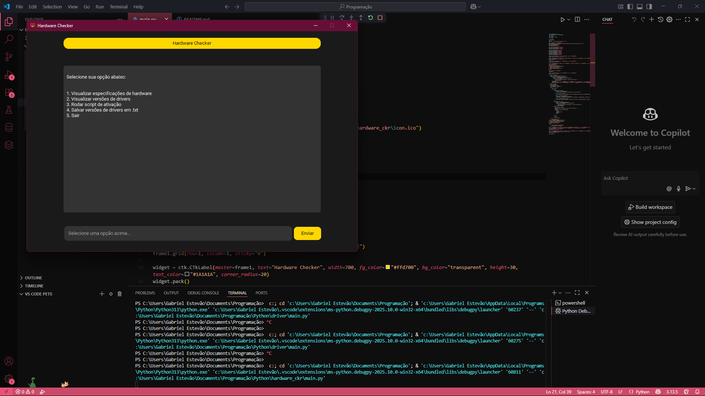

# 🚀 Hardware Checker

> **Uma ferramenta elegante e eficiente para consultar especificações e drivers de hardware no Windows.**  
> Desenvolvida com `customtkinter` para uma interface moderna e intuitiva.

---

## ✨ Funcionalidades

- Exibe informações detalhadas do hardware:  
  - Placa-mãe (Modelo, marca e S/N)
  - CPU (núcleos e threads)  
  - Memória RAM (capacidade, frequência e fabricante)  
  - GPU (nome e memória de vídeo)
- Lista versões dos drivers instalados no sistema
- Executa um script de ativação via PowerShell (com privilégios administrativos)
- Salva versões dos drivers em arquivo `.txt` com timestamp
- Atualiza os drivers da máquina
- Mostra portas abertas em diferentes estados
- Interface gráfica escura, responsiva e agradável aos olhos

---

## 📸 Preview



---

## 🚀 Como usar

1. Clone o repositório:
    ```bash
    git clone https://github.com/gaaBa0/hardware_checker.git
    cd hardware-checker
    ```

2. Instale as dependências:
    ```bash
    pip install -r requirements.txt
    ```

3. Execute o programa:
    ```bash
    python main.py
    ```

4. Escolha uma das opções no campo de entrada e pressione Enter ou clique em "Enviar".

---

## 🎨 Tecnologias usadas

- Python 3.x  
- [customtkinter](https://github.com/TomSchimansky/CustomTkinter) - para a GUI moderna  
- [CTkMessagebox](https://github.com/TomSchimansky/CustomTkinter/tree/master/CTkMessagebox) - mensagens estilizadas  
- [wmi](https://github.com/tjguk/wmi) - acesso ao hardware Windows Management Instrumentation  
- [psutil](https://github.com/giampaolo/psutil) - checagem de estado das portas
- ctypes (módulo interno Python) - para executar comandos PowerShell com privilégios
- time (módulo interno python)

---

## ⚙️ Requisitos do sistema

- Windows 10 ou superior (aplicação depende do WMI e PowerShell)  
- Python 3.8+ instalado  
- Conexão com internet para rodar o script de ativação (opção 3)

---

## 📁 Estrutura do projeto

```
hardware_checker/
├── main.py
├── requirements.txt
├── icon.ico
├── tks.ico
└── README.md
```

---

## 🛠️ Melhorias futuras

- Adicionar suporte multiplataforma []
- Interface responsiva para diferentes resoluções [] 
- Histórico de consultas e exportação para outros formatos (CSV, JSON) [] 
- Suporte a múltiplos idiomas [] 

---

## 📝 Licença

Este projeto está licenciado sob a MIT License.

---

> **Desenvolvido com paixão e linhas de código afiadas.**  
> Transformando bits em arte funcional.
